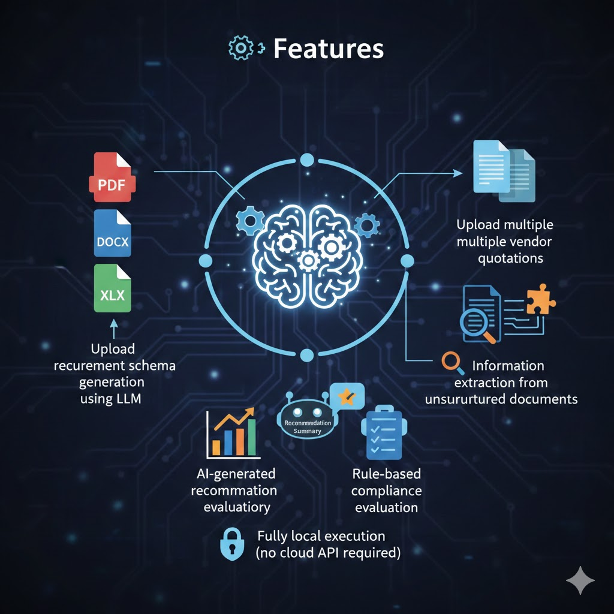

## 📄 Smart Procurement Assistant (Local LLM)

A lightweight AI-assisted procurement application that uses a locally hosted Large Language Model (LLM) to extract, structure, and compare vendor quotations against procurement requirements.

The application runs fully locally using Ollama, without requiring external API services.

### 🚩 Project Overview

Procurement evaluation often involves manually reviewing specification documents and vendor quotations in different formats (PDF, Word, Excel).
This project demonstrates how a local LLM can assist in:

- converting procurement specifications into structured requirements
- extracting structured information from vendor quotations
- comparing vendor compliance against requirements
- generating a simple recommendation summary

The goal of this project is workflow augmentation, not full automation.

### ⚙️ Features


*Image generated by Nano Banana*

- 📄 Upload procurement specifications (PDF / DOCX / XLSX)
- 🧠 Automatic requirement schema generation using LLM
- 📑 Upload multiple vendor quotations
- 🔎 Information extraction from unstructured documents
- 📊 Rule-based vendor compliance evaluation
- 🤖 AI-generated recommendation summary
- 🔒 Fully local execution (no cloud API required)

### 📁 Project Structure

```
.
├── app.py
├── llm/
│   ├── schema_generator.py
│   ├── model_builder.py
│   ├── quotation_extractor.py
│   ├── evaluator.py
│   └── recommender.py
│
├── loaders/
│   └── document_loaders.py
│
├── utils/
│   └── json_parser.py

```


### 🚀 Installation

1. Clone repository
```
git clone https://github.com/shihjen/llm_ProcurementAssistant.git
cd llm_ProcurementAssistant
```

2. Create virtual environment
```
python -m venv .venv
.venv/Scripts/activate
```

3. Install dependencies
```
pip install -r requirements.txt
```

4. Install and run Ollama

Install Ollama:

👉 https://ollama.com

Pull a local model:
```
ollama pull gpt-oss
```

Start Ollama service before running the app.

5. Run application
```
streamlit run app.py
```

### 🧪 Process Workflow


*Image generated by Nano Banana*

1. Upload procurement specification
2. Generate requirement schema
3. Upload vendor quotation documents
4. Review compliance comparison
5. Generate recommendation summary


### ⚠️ Limitations

- Extraction accuracy depends on document quality and model capability
- Local LLMs may occasionally produce inconsistent JSON outputs
- Evaluation logic currently assumes simplified requirement comparison
- Not intended for production procurement decisions

This project is intended for learning and experimentation with local LLM workflows.
